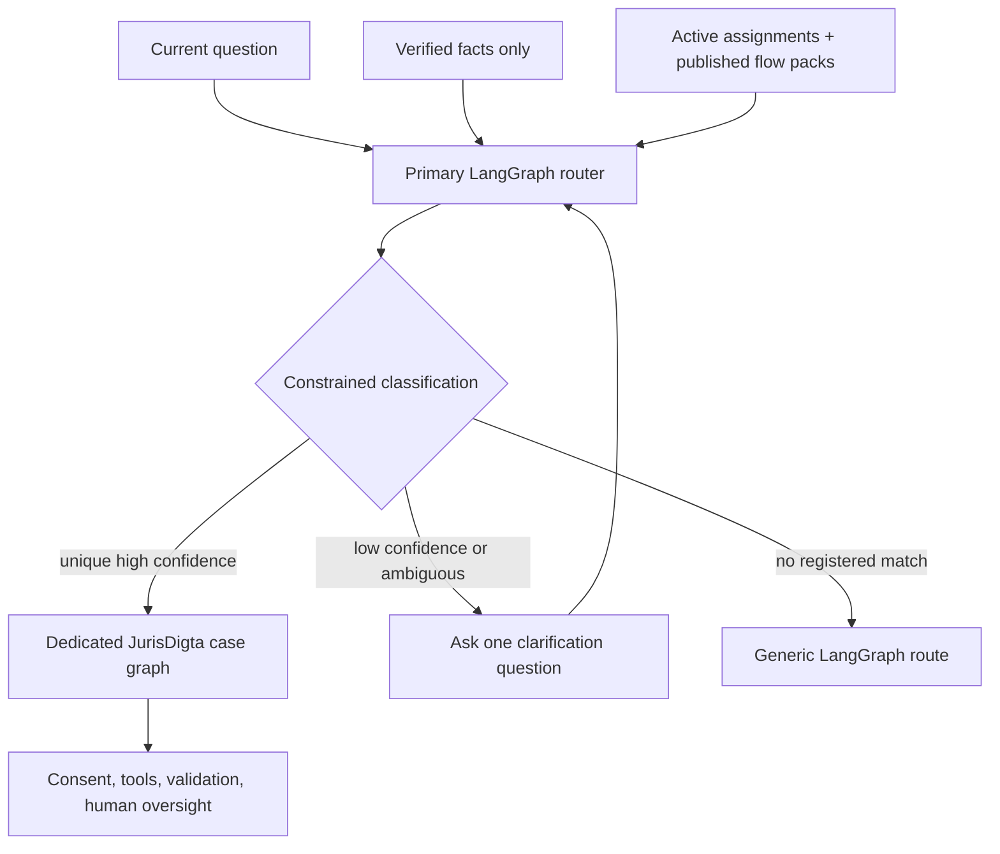
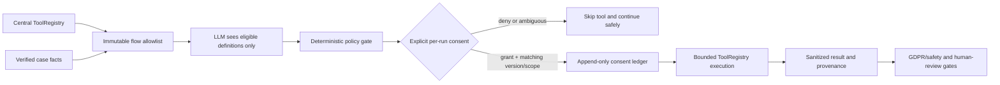

# LangGraph case orchestration

JurisDigta uses LangGraph as the primary chat orchestrator and a registered, versioned runtime for
guided legal cases. The first active reference is `sk.civil.payment_confirmation@4` on
`legal_document_workflow@3`; all other enabled Slovak case types receive an explicit
`unsupported_or_human_review@1` assignment until their legal configuration is reviewed.

Every normal chat question enters `PrimaryLangGraphRouter`. Its classifier receives only the
current question, verified facts, and candidates derived from active assignments backed by enabled,
published immutable flow packs. A unique high-confidence match enters the dedicated case graph;
an ambiguous or low-confidence result asks one clarification question; and no match follows the
generic LangGraph route. There is no environment-maintained case-type allowlist and the model cannot
invent a candidate key.



## Runtime contract

Each run pins `case_type_key`, `graph_key@version`, and immutable `flow_key@version`. Assignment
changes apply only to new runs. Python graph code is selected only from the reviewed registry in
`app/case_workflows/registry.py`; administrators cannot submit executable code, arbitrary nodes,
or transitions.

The legal-document graph routes and pins configuration, validates facts, interrupts for one
missing fact at a time, retrieves current requirements through JurisDigta MCP, executes only consented
allowlisted tools, blocks conflicts, drafts, runs output and GDPR/safety checks, performs final
case review, and completes or escalates. MCP/model/tool failures remain visible and cannot become
fabricated success. `LANGGRAPH_STRICT_MSGPACK=true` prevents permissive checkpoint serialization.

Graph v2 performs required-fact validation before retrieval. Its immutable flow policy supplies a
reviewed `policy_id`, allowed case types and jurisdictions, bounded MCP limits, a reviewed default
query, and optional mappings from verified fact aliases to reviewed legal-search queries. Raw fact values are
never appended to the query. Unknown or instruction-like values are omitted, and an invalid policy
blocks the run. Audit events record the policy identifier, source IDs, and matched-fact count—not the
query or personal facts. Graph v1 remains registered only so existing pinned runs can resume.

Graph v3 adds model-proposed, policy-gated tool execution. The central registry can grow without
exposing its unrestricted contents: the immutable flow version first filters definitions by tool
name, jurisdiction, required verified facts, purpose, provider, permitted data fields, consent
scope/version, and timeout. The model sees only those eligible public definitions and may propose
at most one narrow tool. Its proposal is never authorization.



The reusable engine supports the registered company, address, property, vehicle, and debtor tools
when a relevant reviewed flow allowlists and maps their inputs. Payment confirmation v4 currently
allowlists only company, address, and debtor checks because property and vehicle queries are not
necessary for that purpose. A denial, an ambiguous reply, stale consent text, mismatched scope,
missing ledger event, invalid model output, timeout, or unregistered tool fails closed without an
external call. Execution is idempotent per workflow run/tool/consent event.

PostgreSQL production checkpoints use `PostgresSaver`; local deterministic tests use
`InMemorySaver`. Run metadata and append-only sanitized audit events are stored in the API
database by migrations `0020_langgraph_case_workflows.sql` and
`0021_langgraph_tool_consent.sql`. Runtime database files remain under
`runs/storage/api/`, never under `databases/`.

## API and channels

- `GET /v1/case-workflows/graphs` lists reviewed graph versions.
- `GET /v1/case-workflows/assignments` lists active and historical assignments.
- Admin-only `POST /assignments/validate` validates graph, case type, flow lifecycle, schema, and
  compatibility.
- Admin-only `POST /assignments` requires explicit `confirmation=true` when replacing a default.
- `POST /runs`, `POST /runs/{id}/resume`, `GET /runs/{id}`, and `GET /runs/{id}/events` expose the
  shared web/mobile/chat-simulator workflow state.

The chat API uses primary routing when `AI_CASE_ORCHESTRATION_MODE=active`; `legacy` is the emergency
rollback setting. Legal-research messages enter the primary router, receive no dedicated document
flow match, and continue through the established cited MCP research executor. Document orchestration
takes precedence only when a registered published flow confidently matches the requested outcome.

For the real local regression, `scripts/prepare_issue_713_latest_law_e2e.py` seeds only isolated
synthetic PostgreSQL records and writes the expected MCP source ID to an ignored manifest under
`runs/e2e/issue-713-latest-law/`. Retain its sanitized manifest and final screenshot for at most
seven days.

## GDPR and EU AI Act controls

State is user/case scoped. Events contain identifiers, counts, decisions, model/tool route
metadata, and source IDs—not prompts, credentials, raw tool records, or unnecessary personal facts.
The workflow consent slice records the exact per-run purpose, provider, permitted fields, scope,
text version, and decision. It is intentionally narrower than the account-wide preference,
withdrawal, and DSAR program tracked by #389; no account-wide consent is inferred or reused. Adverse or
ambiguous screening, missing evidence, conflicts, failed validators, and unsupported case types
require human review. Outputs disclose AI assistance and the need for human review.
If model prose omits a user-verified value, the workflow appends that exact value in a labeled
verified-data section before validation. It never infers or fills an absent value.

Case deletion removes associated workflow run state, consent/execution ledger rows, audit events,
and checkpoints with the parent case. Publishing and assigning another dedicated flow requires the
same privacy, legal, and real-path E2E review used for the payment-confirmation reference flow; the
primary router discovers it automatically after activation.

## Operations and rollback

Production deploy selects `active` or `legacy` explicitly. Roll back by dispatching the exact
validated commit with `case_orchestration_mode=legacy`; never change a running case's pinned
versions. A retired flow version cannot be republished, and a published version cannot be edited.

Deployments can contain the legacy `sk.civil.payment_confirmation@1` definition created before
the MCP retrieval policy became mandatory and the compatible `@2` definition with query keys.
Startup preserves published versions, seeds consented-tool `@4`, and upgrades only the active
system-seeded assignment for new cases to graph v3/flow v4. Existing workflow runs remain pinned
to their original graph and flow versions, while administrator-created assignments are not
silently replaced.

Run the deterministic example:

```powershell
python examples/langgraph_case_workflow_demo.py
```

Final acceptance additionally requires the real local frontend → API → MCP → PostgreSQL → Azure
Foundry E2E and its PDF, first-page render, screenshot, and sanitized manifest.
Prepare its synthetic records only after the API and laws schemas are applied to dedicated local
databases. The preparation command requires `DB_OPTION=postgres`, loopback `DB_CLOUD`,
`LAWS_DB_BACKEND=postgres`, and a loopback `LAWS_DB_CLOUD` database whose name contains `e2e`:

```powershell
python scripts/prepare_issue_635_langgraph_e2e.py
```

The script refuses non-loopback or non-E2E law databases, upserts only the synthetic
`issue-635-civil-code` source, and writes ignored evidence under `runs/e2e/issue-635-langgraph/`.

The consented-tool acceptance uses the same isolated legal fixture plus a branch-local API
database and a synthetic address. Prepare it with:

```powershell
python scripts/prepare_issue_716_langgraph_tools_e2e.py
```

Then run `e2e/issue-716-langgraph-consented-tools.spec.ts` with the emitted
`ISSUE_716_E2E_MANIFEST` and `ISSUE_716_E2E_EVIDENCE` paths. The test requires the real
Azure Foundry route, asserts graph v3/flow v4, the visible policy-bound consent prompt, sanitized
ToolRegistry result, append-only PostgreSQL consent/execution rows, MCP source identity, PDF/text
integrity, case-ledger deletion, and a stable final screenshot.
