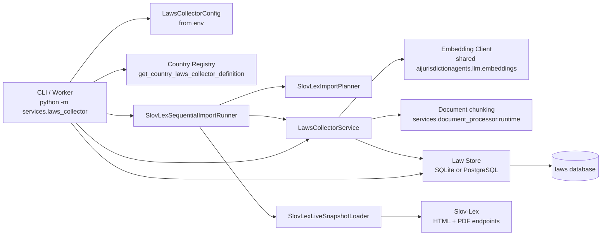
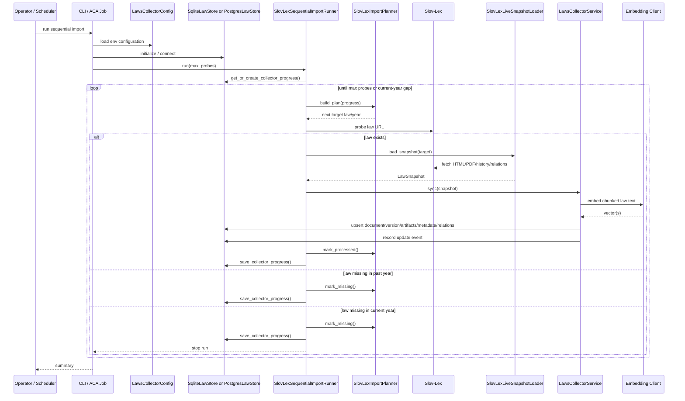
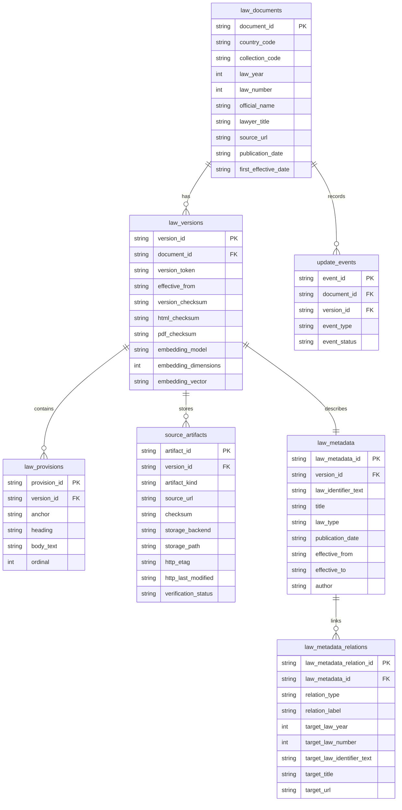
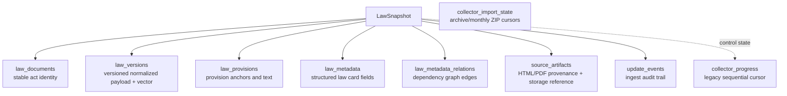
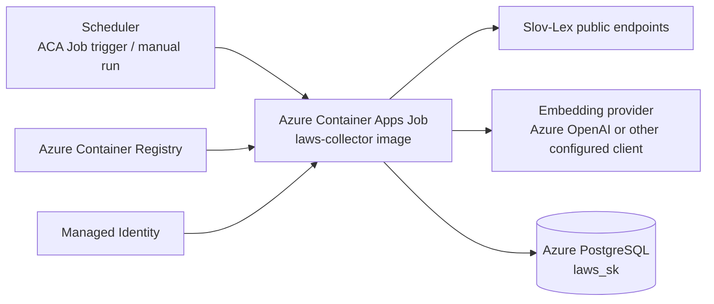

# Law Collector Architecture

## Purpose

This document describes the current architecture of the `laws_collector` service implemented under `src/services/laws_collector/`.

The diagrams use Mermaid because VS Code Markdown Preview renders Mermaid diagrams directly.

Current implementation status:

- country-specific collector registry exists
- only Slovakia (`SK`) is implemented
- source system is `Slov-Lex`
- runtime supports local SQLite and cloud PostgreSQL
- deployment target is Azure Container Apps / Jobs

## Source Files

- `src/services/laws_collector/cli.py`
- `src/services/laws_collector/config.py`
- `src/services/laws_collector/country_registry.py`
- `src/services/laws_collector/service.py`
- `src/services/laws_collector/import_planner.py`
- `src/services/laws_collector/slovlex_process.py`
- `src/services/laws_collector/slovlex_live_source.py`
- `src/services/laws_collector/source_artifact_storage.py`
- `src/services/laws_collector/sqlite_store.py`
- `src/services/laws_collector/postgres_store.py`
- `infra/scripts/deploy_laws_collector.ps1`
- `infra/bicep/laws_collector.job.bicep`

## High-Level View



## Main Responsibilities

### 1. Configuration

`LawsCollectorConfig` reads environment variables and normalizes runtime settings:

- `LAWS_COUNTRY`
- `LAWS_DB_BACKEND`
- `LAWS_DB_LOCAL`
- `LAWS_DB_CLOUD`
- `LAWS_STORAGE_LOCAL`
- `LAWS_STORAGE_CLOUD`
- `LAWS_DELTA_POLL_HOURS`

Default local database path follows the repository storage rule:

- SQLite: `runs/storage/laws-collector/sqlite/sk_laws.sqlite3`

### 2. Country Selection

`country_registry.py` chooses the collector definition by country code.

Current state:

- `SK` -> `slovak_laws_collector`

The registry binds:

- service factory
- baseline fixture snapshots
- delta fixture snapshots
- cloud database name

### 3. Sequential Live Import

The live Slovakia path now has two runners:

- `SlovLexZipImportRunner` for the default archive + monthly ZIP flow
- `SlovLexSequentialImportRunner` for the legacy `one_law_url` per-law probe flow

Rules implemented today:

- start at `1/1945`
- probe laws sequentially by `number/year`
- if a law exists, load and ingest it
- if a gap is found in a past year, move to `1/<next year>`
- if a gap is found in the current year, stop and persist that gap as the next target

State is now persisted in two places:

- `collector_progress` for the legacy sequential probe cursor
- `collector_import_state` for ZIP archive/monthly resume state and archive completion tracking

After a ZIP archive/monthly import, `collector_progress` is advanced to the highest imported law number/year. That lets the five-minute live probe continue from the newest known Slov-Lex act instead of replaying old archive entries.

### 4. Snapshot Loading

`SlovLexLiveSnapshotLoader` downloads and normalizes Slov-Lex source artifacts:

- published HTML
- effective HTML version when available
- PDF
- metadata from `Informacie o predpise`
- dependency edges from `Vztahy predpisu`
- provision text blocks

The loader produces one `LawSnapshot`.

### 5. Ingestion

`LawsCollectorService.sync()` stores each snapshot in the selected database.

For each law it:

1. upserts the document
2. computes checksums
3. builds normalized JSON
4. creates embeddings from chunked content
5. upserts the version
6. replaces provisions
7. upserts law metadata
8. replaces law relations
9. stores source artifacts
10. records update events

### 6. Persistence

The collector uses a store abstraction:

- `SqliteLawStore`
- `PostgresLawStore`

Both implement the same logical write model, so the service layer stays storage-agnostic.

## Runtime Sequence



## Data Model

The collector separates law identity, versioned content, normalized provisions, metadata, relations, source artifacts, and operational state.



Additional operational table:

- `collector_progress`
- `collector_import_state`

That table stores:

- last collector run timestamp
- last processed law year/number
- next probe law year/number

## Storage Layers



## Deployment View

Current repository intent is a scheduled worker in Azure, backed by PostgreSQL.



Deployment assets in the repo:

- PowerShell deploy script: `infra/scripts/deploy_laws_collector.ps1`
- Bicep job template: `infra/bicep/laws_collector.job.bicep`

## Current Ingest Pipeline Details

### Input side

The live loader pulls from Slov-Lex:

- law landing page by `number/year`
- published HTML
- effective HTML version when available
- PDF

### Transformation side

The loader extracts:

- official title
- publication/effective dates
- approval date
- law type
- author
- legal areas
- issue reference
- provision text blocks
- relation edges:
  - `amends`
  - `amended_by`
  - `implements`
  - `repeals`

### Output side

The service persists:

- raw artifacts for audit/debug
- normalized JSON for deterministic version checks
- provision rows for later search/chunking
- metadata fields for filtering and UI display
- relation edges for chain/graph visualizations
- one averaged embedding vector per stored law version

Shared embedding runtime:

- default runtime mode is `SYSTEM_EMBEDDING_MODEL_OPTION=local`
- default local model is `SYSTEM_EMBEDDING_MODEL=all-MiniLM-L6-v2`
- default local device selection is `SYSTEM_EMBEDDING_DEVICE=auto`, which tries CUDA/MPS and falls back to CPU if GPU support is unavailable or fails at runtime
- local NVIDIA GPU use requires a CUDA-enabled PyTorch build; use `scripts/install_cuda_torch.ps1` for the repo conda environment
- local model files are cached in `aimodels/`
- Azure worker deployments default `SYSTEM_EMBEDDING_MODEL_OPTION=local`

## Extension Points

The architecture is already split so future work can extend without rewriting the whole collector.

Main extension seams:

- add more countries in `country_registry.py`
- add alternative live loaders beside Slov-Lex
- add richer update planning on top of `plan_updates()`
- move from one averaged law vector to provision-level vectors
- add graph traversal or visualization over `law_metadata_relations`
- expose collector status via API using `collector_progress`

## Operational Risks

Known practical constraints in the current design:

- only Slovakia is implemented
- live probing is sequential, so first backfill can take time
- one averaged embedding per law is simple but loses some section-level precision
- remote deployment assets need naming consistency between script and Bicep template
- production deployment depends on external services:
  - Slov-Lex availability
  - embedding provider availability
  - PostgreSQL connectivity

## Minimal Runnable Example

Local demo:

```powershell
python examples/laws_collector_minimal_demo.py
```

Local embedding similarity demo:

```powershell
python examples/local_embedding_semantic_search_demo.py
```

Sequential live import demo:

```powershell
python -m services.laws_collector --run-sequential-import --max-probes 1
```

## Recommended VS Code Usage

Open this file in Markdown Preview:

```text
Ctrl+Shift+V
```

If Mermaid does not render, make sure VS Code Markdown Preview is enabled and up to date.
