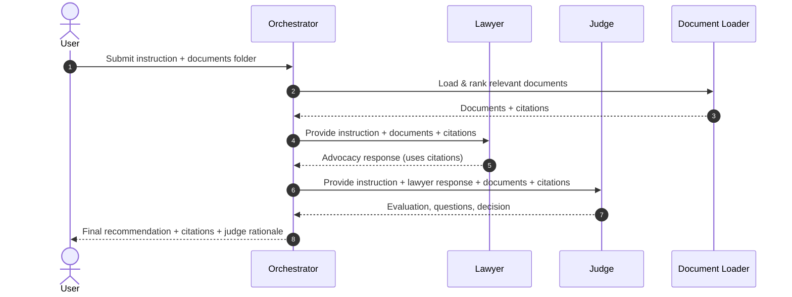

# Sequence Diagram (High Level)

```mermaid
sequenceDiagram
    autonumber
    actor User
    participant Orchestrator
    participant Lawyer
    participant Judge
    participant Docs as Document Loader

    User->>Orchestrator: Submit instruction + documents folder
    Orchestrator->>Docs: Load & rank relevant documents
    Docs-->>Orchestrator: Documents + citations
    Orchestrator->>Lawyer: Provide instruction + documents + citations
    Lawyer-->>Orchestrator: Advocacy response (uses citations)
    Orchestrator->>Judge: Provide instruction + lawyer response + documents + citations
    Judge-->>Orchestrator: Evaluation, questions, decision
    Orchestrator-->>User: Final recommendation + citations + judge rationale
```
