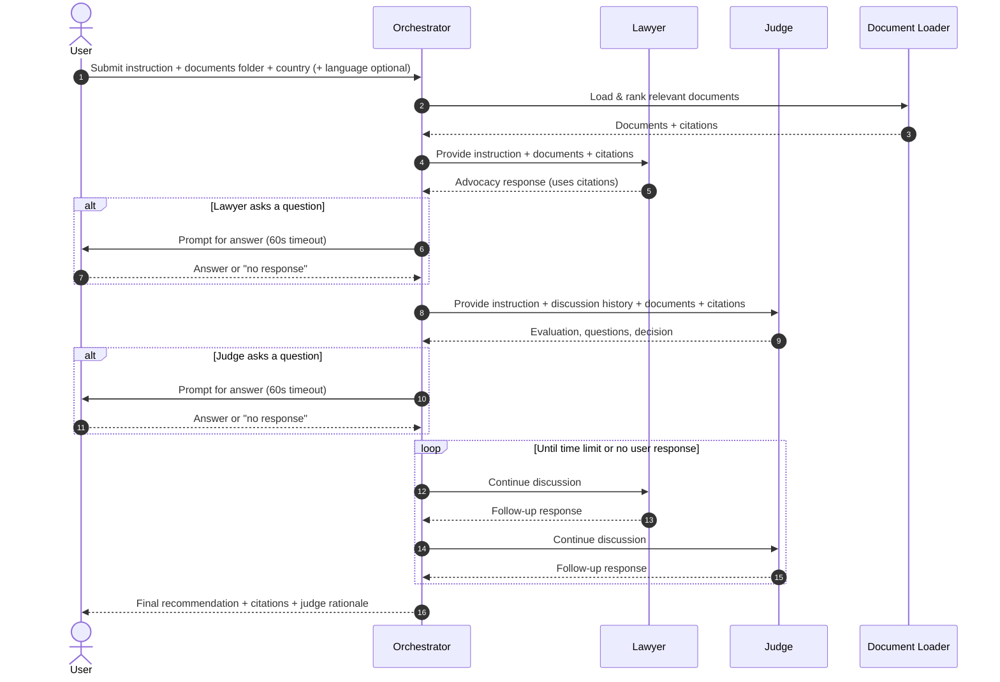

# Sequence Diagram (High Level)

```mermaid
sequenceDiagram
    autonumber
    actor User
    participant Orchestrator
    participant Lawyer
    participant Judge
    participant Docs as Document Loader

    User->>Orchestrator: Submit instruction + documents folder + country (+ language optional)
    Orchestrator->>Docs: Load & rank relevant documents
    Docs-->>Orchestrator: Documents + citations
    Orchestrator->>Lawyer: Provide instruction + documents + citations
    Lawyer-->>Orchestrator: Advocacy response (uses citations)
    alt Lawyer asks a question
        Orchestrator->>User: Prompt for answer (60s timeout)
        User-->>Orchestrator: Answer or "no response"
    end
    Orchestrator->>Judge: Provide instruction + discussion history + documents + citations
    Judge-->>Orchestrator: Evaluation, questions, decision
    alt Judge asks a question
        Orchestrator->>User: Prompt for answer (60s timeout)
        User-->>Orchestrator: Answer or "no response"
    end
    loop Until time limit or no user response
        Orchestrator->>Lawyer: Continue discussion
        Lawyer-->>Orchestrator: Follow-up response
        Orchestrator->>Judge: Continue discussion
        Judge-->>Orchestrator: Follow-up response
    end
    Orchestrator-->>User: Final recommendation + citations + judge rationale
```
