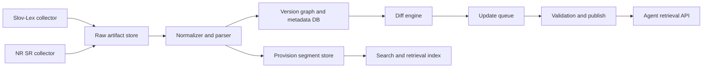

# Slovak Law Corpus And Update Pipeline

## Goal

Build a Slovak-law corpus that can:

- ingest the full Collection of Laws from official sources,
- preserve historical versions and effective dates,
- detect amendments and newly published acts,
- expose grounded retrieval for the existing agent/orchestration stack,
- keep a clear provenance trail back to the official publication.

## Official source strategy

Use official state sources as the canonical input layer:

- `Slov-Lex` for the Collection of Laws, published texts, historical versions, and per-act metadata.
- `NR SR` legislative-process pages for pre-publication monitoring, explanatory reports, and bundled proposal files.

Important source constraint:

- Slov-Lex pages explicitly state that the displayed HTML text is informative and the legally binding content is in the PDF version.
- Because of that, store both the machine-friendly HTML and the official PDF artifact for every ingested version.

## Recommended architecture



## Storage model

Keep a hybrid layout consistent with the existing repository direction:

- PostgreSQL or SQLite for metadata, version relationships, and stored law documents.
- A searchable provision index for paragraph-level retrieval.

Recommended core tables:

| Table | Purpose |
| --- | --- |
| `law_documents` | One row per legal act, keyed by `year + number + type`. |
| `law_versions` | One row per published or effective-time version of an act. |
| `law_provisions` | Normalized sections, paragraphs, letters, annexes. |
| `law_relationships` | Amendment, repeal, reference, implementing-regulation links. |
| `source_artifacts` | HTML/PDF payloads, checksum, fetch time, source URL, ETag, download state. |
| `update_events` | Discovered change, parser result, publish result, failure state. |
| `legislative_proposals` | Draft-bill metadata from NR SR before publication in Slov-Lex. |

Recommended important columns for download integrity:

- `official_name`
- `lawyer_title`
- `first_stored_at`
- `last_stored_at`
- `last_checked_at`
- `version_checksum`
- `html_checksum`
- `pdf_checksum`
- `content_bytes`
- `http_etag`
- `http_last_modified`
- `download_attempt_count`
- `last_download_status`
- `last_download_error`
- `should_redownload`

## Ingestion flow

### 1. Initial backfill

Run a bulk importer across yearly Slov-Lex Collection-of-Laws indexes.

For each discovered act:

1. Capture source URL, act number, publication date, effective date, and author.
2. Download the informative HTML and the legally binding PDF.
3. Normalize structure into sections, paragraphs, points, letters, and annexes.
4. Persist the source artifact bodies, parsed structure, and search segments inside the database.
5. Build citation anchors so agents can cite `act + paragraph + effective version + source URL`.

### 2. Incremental update job

Schedule a frequent collector, for example every morning and one midday retry.

It should:

1. Poll the current Slov-Lex Collection-of-Laws year page and compare discovered acts against stored checksums.
2. Revisit recent acts whose effective date is in the future because they often gain a new effective-time version.
3. Inspect the history section of acts already known to detect newly effective consolidated versions.
4. Poll NR SR legislative pages to track proposals that may later become published acts.
5. Create `update_events` for:
   - `new_act`
   - `new_version`
   - `metadata_change`
   - `proposal_detected`
   - `parser_failed`

### 3. Diff and validation

For every new version:

- compute structural diffs on provisions, not only whole-document hashes,
- flag renumbering separately from real textual change,
- validate that headings, numbering, annex references, and effective dates remain consistent,
- keep the previous version immutable.

## Update semantics

You do not want a single "latest text" table only. You need a version graph.

Recommended rules:

- A newly published act creates a new `law_document`.
- An amendment creates a new `law_version` on the amended act, not just on the amending act.
- Repealed provisions stay queryable historically but are marked inactive after their end date.
- Every answer produced by agents should resolve against an `effective_on` date.

That lets the system answer both:

- "What is the current law?"
- "What was the law on 1 January 2024?"

## Retrieval for agents

For the existing multi-agent architecture, expose a law-corpus retrieval service with:

- lexical retrieval by act number and paragraph,
- semantic retrieval over normalized provisions,
- effective-date filtering,
- provenance payload containing source URL, fetched artifact checksum, and version id.

The orchestration layer should retrieve:

- the exact provision text,
- a short machine summary,
- amendment history for the cited provision,
- confidence flags if only informative HTML was parsed and the PDF has not yet been validated.

## Repo fit

If you implement this in this repository, the cleanest module split is:

- `src/aijurisdictionagents/law_corpus/sources/`
- `src/aijurisdictionagents/law_corpus/domain/`
- `src/aijurisdictionagents/law_corpus/application/`
- `src/aijurisdictionagents/law_corpus/infrastructure/`
- `src/aijurisdictionagents/law_corpus/api/`

Suggested responsibilities:

- `sources`: Slov-Lex and NR SR collectors.
- `domain`: document, version, provision, update-event entities.
- `application`: backfill jobs, update jobs, diff orchestration.
- `infrastructure`: DB repositories, blob storage, parser implementations.
- `api`: search, detail, history, and health endpoints.

## Minimal rollout plan

### Phase 1

- Backfill all currently effective Slov-Lex acts.
- Store HTML + PDF + normalized JSON.
- Expose search by act number and paragraph.

### Phase 2

- Add daily incremental update jobs.
- Track future-effective versions and amendments.
- Expose history and diff views.

### Phase 3

- Add NR SR draft monitoring.
- Add operator review queue for parser failures and ambiguous diffs.
- Add semantic retrieval and paragraph embeddings.

## What I would not do

- I would not rely on LLM summaries as the source of truth.
- I would not overwrite old versions in place.
- I would not store only vector embeddings without the exact legal text.
- I would not depend on an undocumented private API when the public HTML/PDF publication is sufficient.

## Mockup

The UI mockup for this proposal is at:

- `docs/mockups/slovak-law-corpus-dashboard.html`

Quick preview:

```powershell
powershell -ExecutionPolicy Bypass -File examples/preview_slovak_law_mockup.ps1
```
