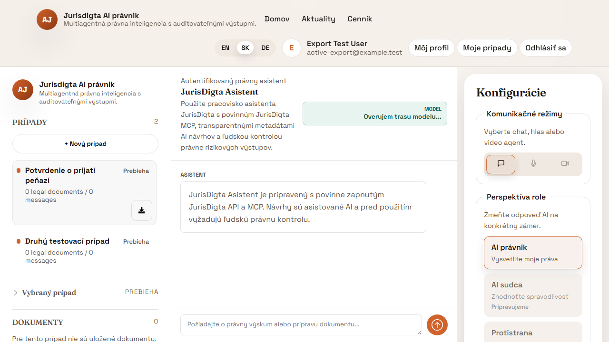
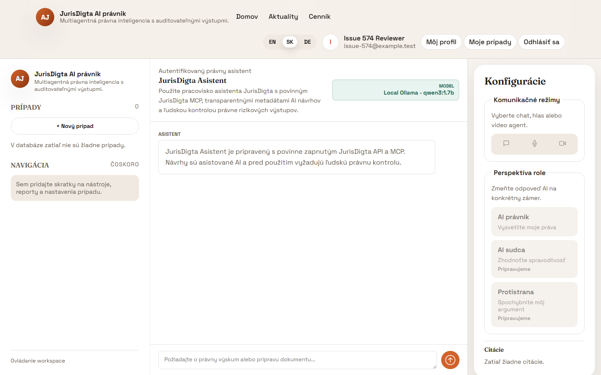
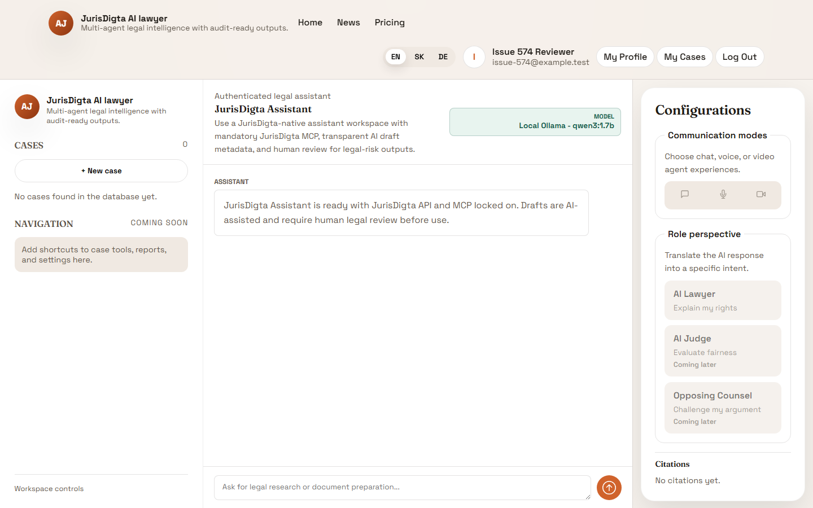
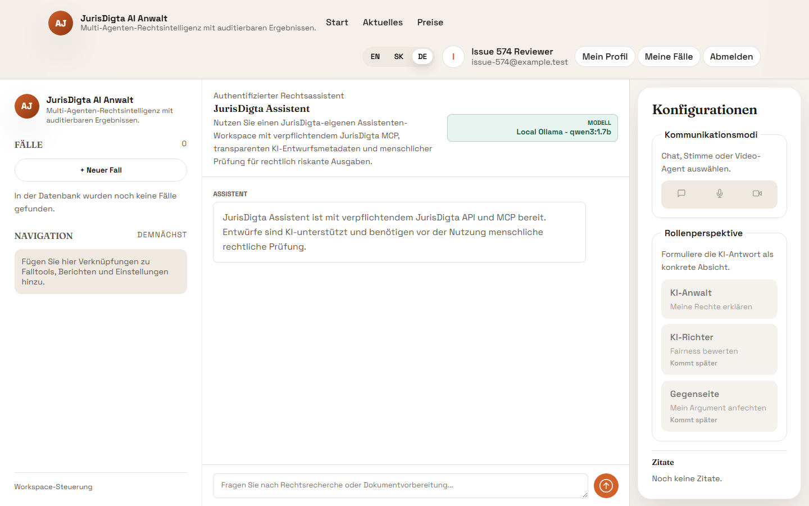

# Jurisdigta AI Frontend

React + TypeScript + Vite frontend workspace for Jurisdigta AI. This UI is aligned with the
`frontend_design` proposal and includes the public marketing pages plus authenticated workflow
screens.

## Runtime

- Node.js 18+
- npm 9+
- Python 3.13 with `PyMuPDF==1.28.2`, `pypdf==6.16.1`, and `reportlab==5.0.0` for
  generated-document E2E evidence; both the frontend CI workflow and the self-managed production
  deployment gate install these pinned packages before Playwright runs.

## Setup

```bash
cd frontend/aijurisdictionfronend
npm install
cp .env.example .env
npm run dev
```

Open `http://localhost:5173`.

## Minimal Runnable Branding Example

Run the frontend with the setup commands above, sign in, and open
`http://localhost:5173/app/assistant`. The sidebar/header brand and browser-tab title both read
`JurisDigta AI právnik` (SK), `JurisDigta AI lawyer` (EN), or `JurisDigta AI Anwalt` (DE), according
to the selected language. Change languages and navigate away and back to `/app/assistant` to verify
that both titles update immediately and retain the persisted language.

## E2E Regression Tests

Run the browser regression suite with:

```bash
npm run test:e2e
```

The suite starts Vite locally and uses mocked JurisDigta API responses. Deployment workflows run this Playwright gate before deployment so a failed document-preview, document-download, or document-listing regression blocks release. If the default Playwright port is already in use, set `FRONTEND_E2E_PORT`, for example `FRONTEND_E2E_PORT=5190 npm run test:e2e`. Issue #503 is covered by `e2e/assistant-live-document-preview.spec.ts`, which verifies the live assistant response path and the post-refresh case-history path both show the formatted JurisDigta document preview, generated PDF action, and citation source. Issues #530 and #574 are covered by `e2e/assistant-branding.spec.ts`, which verifies the localized SK/EN/DE navbar, sidebar brand, and browser title after persisted direct loads, live language changes, and client-side navigation.

Issue #623 is covered by `e2e/issue-623-purchase-law-citations.spec.ts`. The deterministic
scenario submits `Priprav mi template na kupno predajnu zmluvu na dom, nechcem uvadzat
podrobnosti.` and requires the full `§ 588` Civil Code basis both below the purchase-agreement
title and as a clickable official Slov-Lex citation. It also generates and validates a real PDF,
renders its first page, and retains privacy-safe evidence under ignored
`output/playwright/issue-623/` for no more than seven days.

Run the focused scenario from this directory with:

```bash
npm run test:e2e -- e2e/issue-623-purchase-law-citations.spec.ts
```

Run the focused generated-document download/listing regression with:

```bash
npm run test:e2e -- e2e/generated-document-download.spec.ts
```

The generated-document test scopes the open-document button to its sidebar document item and
asserts the filename-specific delete button separately. Keep these controls distinct when their
accessible names share the same filename; do not use positional Playwright selectors to hide an
ambiguous role query.

The issue #574 test writes locale screenshots to
`runs/e2e/issue-574-assistant-branding-{sk,en,de}.png` using synthetic account and API data.

Issue #565 is covered by `e2e/active-case-export.spec.ts`. The test verifies that only the
active My Cases card displays the same accessible export icon button used by My Profile in its bottom-right corner, that the
button uses the existing authenticated case-export endpoint, and that the action follows the
active case when selection changes. Issue #590 extends this regression to require an actual
browser download and visible success feedback; Blob URLs are retained briefly after the click
so the browser can consume the ZIP before cleanup. API errors remain visible beside the case list.
It writes a synthetic-data screenshot to
`runs/e2e/issue-565-active-case-export-button.png`.



### Slovak



### English



### German



## API Chat Integration (Task #238)

The signed-in workspace now uses the live API for case communication in all three modes (`Chat`, `Voice`, `Video`).
Voice and video are simulated by sending transcript payloads through the same chat reply endpoint.

Frontend environment variables:

- `VITE_API_BASE_URL` (default: `https://api-juris-dev.victoriousdesert-e45eec11.westeurope.azurecontainerapps.io`)
- `VITE_API_KEY` (default: `aijuris`)
- `VITE_API_COUNTRY` (default: `SK`)
- `VITE_API_LANGUAGE` (default: `en`)
- `VITE_CHAT_MODEL_LABEL` (default: `Azure Foundry model`; public label shown in the assistant chat header)
- `VITE_AIJ_SPEECHTYPE` (default: `message`; use `conversation` for the existing Voice-agent transcript flow)

Speech input:

- `message` mode shows audio and microphone controls in the normal chat composer. Browser-native STT fills the visible text input first, and the reviewed text is sent through the normal chat API path.
- `conversation` mode keeps the existing Voice-agent transcript screen available for speech-first sessions.
- The browser path does not upload raw audio to the API. If browser STT is unavailable, the UI falls back to typed input. A future remote STT fallback must require explicit consent before raw audio upload.

Flow used by the workspace:

1. `POST /v1/chat/sessions` once per case.
2. `POST /v1/chat/sessions/{session_id}/reply` for each outgoing user message.
3. The API response is appended back to the active case timeline.

Console logging:

- Frontend emits process logs to browser console with `INFO`, `WARN`, and `ERROR` levels.
- API request lifecycle and failures are logged with structured JSON context.

## JurisDigta Account Login

The web app signs users in through the same API user table used by the mobile app and MCP account flows.

- Login submits `email` and `password` to `POST /v1/users/sign-in`.
- New users start from the `Sign up` action on `/auth`. Registration fields stay hidden until the user chooses that action.
- Registration first collects only the required account details: phone number, email, and password.
- Email OTP verification remains a second step after those details are entered. The frontend calls `POST /v1/users/sign-up/send-code`, then completes the account with `POST /v1/users/sign-up/complete`.
- The request uses `VITE_API_BASE_URL` and `VITE_API_KEY`, matching the existing frontend API client configuration.
- The returned user profile is cached in browser `sessionStorage` for the current browser session.
- Passwords are never stored by the frontend.

## Signed-in Homepage

When authenticated, the home page switches to a 3-column workspace layout (case sidebar, active workspace, AI configuration). On smaller screens the side panels collapse for a single-column layout.

## Protected App Routes

All `/app/*` routes and `/profile` are guarded by API-backed web auth state.

- Unauthenticated users are redirected to `/`
- Authenticated users can access the full app area (`/app`, `/app/workspace`, etc.) and `/profile`
- `/app/chat` is kept as a protected compatibility alias that redirects to `/app/assistant`
- Logging out from the profile dropdown immediately removes access to protected routes

## JurisDigta Assistant Workspace (Issue #356)

The first assistant-ui integration slice adds an authenticated route:

`/app/assistant`

Implementation notes:

- Uses `@assistant-ui/react` `0.14.23` with a local runtime adapter shape that can be replaced by the future Assistant Gateway.
- Keeps JurisDigta API/MCP as a locked mandatory capability in the UI.
- Shows Slovakia-first V1 modes for legal search, document preparation, person/company screening, car validation, and location validation.
- Does not execute arbitrary third-party MCP calls from the browser.
- Marks sensitive verification/screening flows as explicit-approval and consent/legal-basis gated before execution.
- Shows transparency metadata: AI-assisted draft, legal-review-required risk level, and required human oversight.
- Shows the public AI model/runtime label used for the chat. Do not put API keys, URLs, connection strings, or secret deployment values into `VITE_CHAT_MODEL_LABEL`; it is compiled into the browser bundle.
- All user-facing assistant strings are translated for `en`, `sk`, and `de`.

Production deployment preparation:

- The route is served by the existing `jurisdigta-web` container on local port `8090`.
- Publish `agent.jurisdigta.eu` through Cloudflare Tunnel to `http://127.0.0.1:8090`.
- Current production uses the JurisDigta account login at `/auth`; do not configure Cloudflare Access for `agent.jurisdigta.eu` unless the auth plan changes.
- Login credentials are verified by the API against the PostgreSQL-backed users table.
- Validate `https://agent.jurisdigta.eu/health` and `https://agent.jurisdigta.eu/app/assistant` after DNS/tunnel setup.

## Assistant Gateway Case Answer Flow

The protected `/app/assistant` route includes a gateway-backed intake panel where a
signed-in user can create a new case target or use an existing case ID, attach documents,
send a question, and render the returned answer.

Default endpoint:

```text
POST /api/assistant/cases/answer
```

Override it with:

```bash
VITE_ASSISTANT_GATEWAY_URL=https://api.example.test/api/assistant/cases/answer npm run dev
```

The request is multipart form data with `question`, `case_mode`, `case_id`, `country`,
`language`, `consents`, and zero or more `documents` file fields. The browser never calls
MCP tools directly; Assistant Gateway must perform auth, case access checks, consent/policy
validation, document persistence, tool execution, and answer logging.

If the gateway is not reachable, the UI shows a deterministic local fallback answer so the
question/upload/answer rendering path can be tested during frontend development.

## Navbar Branding

The signed-out navigation includes the same app logo treatment used in the signed-in sidebar (`AJ` mark + localized JurisDigta AI name/tagline). The browser title uses the same localized product name on direct loads, language changes, and client-side navigation.

- The logo is rendered on the left side of the navbar for signed-out views.
- The logo is also rendered for signed-in views on non-home routes (for example `/app` and `/profile`).
- On signed-in homepage (`/`), the navbar logo is shown when the workspace sidebar is collapsed.
- The logo links to `/` (marketing homepage).
- The navbar layout is responsive so brand, links, and actions do not overlap at mobile widths.

## Signed-in Profile Dropdown

In signed-in state, the profile icon opens a click-triggered dropdown menu in the navbar.

- Options: `My Profile`, `My Cases`, `Log Out`
- `My Profile` navigates to `/profile`
- `My Cases` currently navigates to `/` (homepage workspace)
- Menu closes on outside click, on option click, and on `Escape`
- Keyboard navigation is supported with `ArrowUp`, `ArrowDown`, `Home`, and `End`
- Mobile layout keeps the dropdown anchored under the trigger with viewport-safe width

## Corporate Theme Visual Regression (Issue #576)

Run the focused Playwright check from `frontend/aijurisdictionfronend`:

```powershell
npx playwright test e2e/corporate-theme-visual.spec.ts
```

Minimal runnable contract verification from the repository root:

```powershell
node examples/frontend_corporate_theme_issue_576_minimal_demo.mjs
```

The test uses only the local `/auth` route, selects English through browser storage, and does
not submit credentials or personal data. It writes the visual artifact to:

```text
output/playwright/codex-576/01-auth-corporate-theme.png
```

The regression test verifies the corporate shield logo, navy, ink, primary button, body
typography, and heading typography so the agent frontend cannot silently return to the
legacy orange and beige theme. The shared shield asset is served from
`public/login-shield.png`, copied from the corporate source at
`corporate-web/assets/login-shield.png`.

## My Profile View

The `/profile` page displays structured user information from the current API-authenticated web session.

- First Name
- Last Name
- Email
- Role (currently optional)
- Account Created Date (currently optional)
- Includes subscription pricing controls (billing cadence + plan selector)
- Includes an opened-cases panel with quick navigation back to active matters
- Long case titles and document names stay inside the left panel. Text is truncated by default;
  the adjacent ellipsis button expands wrapped text and collapses it again without hiding case
  export or document metadata actions.

Minimal runnable layout verification:

```powershell
python examples/frontend_profile_long_text_minimal_demo.py
```

## Mock Case Creation Flow (Task #242)

Task `#242` is implemented as a frontend-only mock flow. It does not create or upload cases/documents through the API.

- `+ New case` opens the intake form at `/app/case`
- The intake form requires:
  - case name
  - jurisdiction
  - opposing party
- Uploading documents is optional
- Submitting the form creates a mock case in frontend storage and opens `/app/assistant`
- The new case appears in:
  - the signed-in homepage sidebar
  - `My Profile` under `Opened cases`
- Uploaded documents appear in `My Profile` under `My Documents`
- Mock cases/documents are stored in browser `localStorage` for local development and tests

## Case Creation Assistant Layout (Issue #369)

Creating a case now opens the canonical assistant workspace at `/app/assistant`.
The legacy `/app/chat` path remains available as a protected redirect to the same assistant
workspace so older links do not render mixed workspace styles.

The frontend layout regression is covered by:

```bash
cd api/aijuristiction-api/e2e-playwright
API_BASE_URL=http://127.0.0.1:8080 FRONTEND_BASE_URL=http://127.0.0.1:5173 npx playwright test tests/frontend-case-create-layout.spec.ts
```

The test creates a case through the UI, captures screenshot artifacts, and checks that the
assistant rail, center conversation area, and right tool panel do not overlap or create
horizontal page overflow at desktop viewports.

## Language Switching (Task #243)

Task `#243` keeps the selected UI language active across routes and applies it to the current page immediately.

- The language switcher selection is stored in browser `localStorage`
- Public routes and signed-in routes reuse the same selected language
- Signed-in workspace labels and sidebar copy update immediately when the user changes language
- App-owned mock case/workspace text is re-localized for `en`, `sk`, and `de`
- User-provided content such as case titles and uploaded filenames stays unchanged
- New chat sessions pass the selected frontend language to the API session creation call

## Chat Window Visuals (Task #245)

Task `#245` refines the signed-in workspace chat presentation.

- The seeded assistant intro message is removed after the user sends the first chat message
- The chat timeline keeps system notices and live API replies intact
- The bottom `Next recommended action` card is removed from the workspace chat view

## Legal pages and footer links

Global footer links are available in all language modes (`en`, `sk`, `de`) and are visible on both public and signed-in screens.

- `/privacy`
- `/disclaimer`
- `/terms`

The disclaimer page includes corrected Slovak, English, and German copy using
the canonical localized product titles from `src/branding.ts`. It covers AI
disclosure, no-legal-advice notice, required human review, no attorney-client
relationship, limitation of liability, no warranty, jurisdiction scope, user
responsibility, external resources, privacy and data minimization, changes to
the notice, and a `Last Updated` timestamp.

The disclaimer supports GDPR and EU AI Act transparency, but it is not a
standalone compliance claim. Operational controls such as lawful-basis records,
retention and deletion enforcement, data-subject-right workflows, processor
governance, security safeguards, traceable logging, and human oversight remain
necessary.

Run the localized browser regression test and capture all three full-page
variants with:

```powershell
npm run test:e2e -- e2e/disclaimer-localization.spec.ts
```

The test writes sanitized screenshots to
`runs/e2e/issue-583-disclaimer-{sk,en,de}.png`. Reviewed copies for pull request
#584 are stored under `docs/screenshots/issue-583/`.

The repository's default minimal runnable example remains:

```powershell
python examples/minimal_demo.py
```

The terms pages use language-specific product titles—`Jurisdigta AI právnik` in Slovak, `Jurisdigta AI Lawyer` in English, and `Jurisdigta AI Anwalt` in German. Each version links to the localized privacy page, asks users to minimize submitted personal data, and warns that AI-generated legal outputs require verification and appropriate human review. These terms do not replace the complete privacy notice and do not introduce unverified controller, processor, lawful-basis, transfer, or retention claims.

Minimal local verification example:

```bash
cd frontend/aijurisdictionfronend
npm ci
npm run dev -- --host 127.0.0.1
```

Open `http://127.0.0.1:5173/terms`, select `SK`, and run the focused automated check in a second terminal:

```bash
cd frontend/aijurisdictionfronend
npm run test -- src/__tests__/termsPage.test.tsx
```

Run the localized browser test to verify the actual language switcher and capture all three full-page variants:

```bash
cd frontend/aijurisdictionfronend
npm run test:e2e -- e2e/terms-localization.spec.ts
```

The test writes `terms-sk.png`, `terms-en.png`, and `terms-de.png` to `runs/e2e/`.

## Callback Contract

The frontend expects auth callback requests to hit:

`/auth/callback`

Required query parameters:

- `provider` (`google` or `x`)
- `id` (string user id)
- `name` (string display name)

Optional query parameters:

- `avatarUrl`

Example callback URL:

`http://localhost:5173/auth/callback?provider=google&id=123&name=Jane%20Doe`

On success, the app stores the session in `localStorage` and redirects to `/`.
On invalid payloads, the callback page shows an explicit error state.

## Lint & Test

```bash
npm run lint
npm run test
```

When mocking `useLanguage` in component tests, provide a stable `t` function reference. Components
that correctly depend on `t` in callbacks can otherwise enter a repeated effect cycle in a test.

## Build

```bash
npm run build
npm run preview
```

`npm run build` runs TypeScript validation before Vite creates the production bundle. Run it
after changes that pass localized strings to shared helpers so translation-key type mismatches
are caught before deployment.

## Self-managed server container

The production container serves the Vite build through nginx with SPA route
fallbacks for `BrowserRouter` routes.

```bash
cd frontend/aijurisdictionfronend
docker build \
  --build-arg VITE_API_BASE_URL=https://api.jurisdigta.eu \
  --build-arg "VITE_CHAT_MODEL_LABEL=Azure Foundry model" \
  -t jurisdigta-web:local .
docker run -d \
  --name jurisdigta-web \
  --restart unless-stopped \
  -p 127.0.0.1:8090:80 \
  jurisdigta-web:local
curl -fsS http://127.0.0.1:8090/health
```

## Minimal Runnable Example (Project Default)

```bash
python examples/minimal_demo.py
```

Task-specific frontend check:

```bash
python examples/frontend_navbar_task_211_minimal_demo.py
```

Task #238 API chat minimal demo:

```bash
python examples/frontend_api_chat_minimal_demo.py
```

Task #242 mock case creation minimal demo:

```bash
python examples/frontend_case_creation_task_242_minimal_demo.py
```

Task #243 language switching minimal demo:

```bash
python examples/frontend_language_switching_task_243_minimal_demo.py
```

Task #245 chat window visuals minimal demo:

```bash
python examples/frontend_chat_window_visuals_task_245_minimal_demo.py
```

Issue #356 assistant workspace minimal demo:

```bash
python examples/frontend_assistant_task_356_minimal_demo.py
```

Issue #398 assistant model disclosure minimal demo:

```bash
python examples/frontend_assistant_model_disclosure_issue_398_minimal_demo.py
```

Issue #401 document preview formatting minimal demo:

```bash
python examples/frontend_document_preview_issue_401_minimal_demo.py
```

Issue #401 browser regression check:

```bash
cd api/aijuristiction-api/e2e-playwright
FRONTEND_BASE_URL=http://127.0.0.1:5173 npx playwright test tests/frontend-document-preview-formatting.spec.ts
```

Issue #503 live document preview minimal demo:

```bash
python examples/frontend_live_document_preview_issue_503_minimal_demo.py
```

Issue #503 browser regression check:

```bash
cd frontend/aijurisdictionfronend
npm run test:e2e -- e2e/assistant-live-document-preview.spec.ts
```

Issue #369 case-create layout minimal demo:

```bash
python examples/frontend_case_create_layout_issue_369_minimal_demo.py
```

The demo defaults to the shared Azure dev API endpoint. Override it for local API testing with
`AIJ_API_BASE_URL=http://127.0.0.1:8080`.
