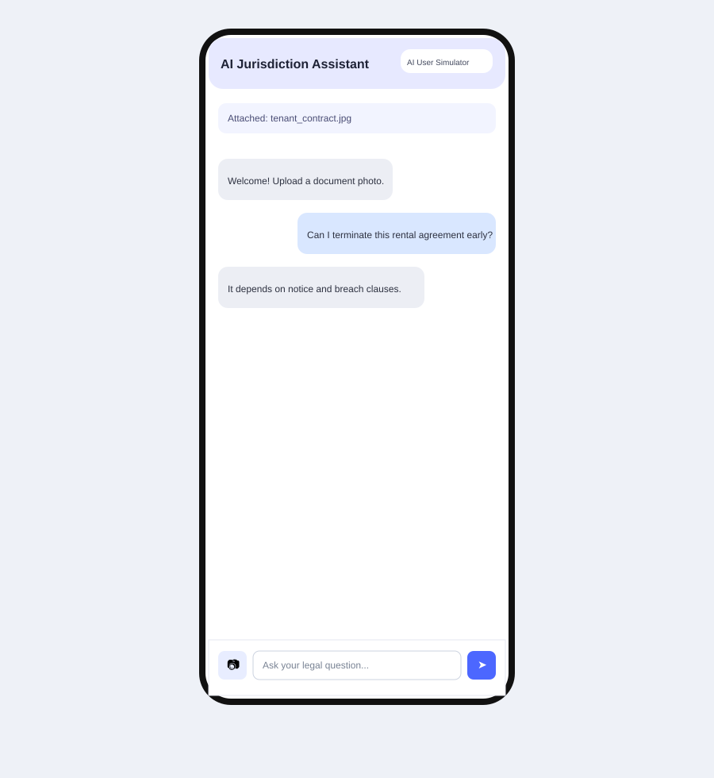

# AI Jurisdiction Mobile (Flutter)

Flutter mobile client prepared for local testing of the AI Jurisdiction chat workflow.

## Features

- Chat-bot style conversation UI.
- Aijurisdicta login-themed background in the chat screen.
- Add supporting documents using the device camera.
- Switch responder mode before the input box:
  - `AI User Simulator` (default for local tests)
  - `Real Person`
- Select country/language before chatting (default: `Slovakia (SK)`).
- Open generated summary/document PDF links directly from the mobile app once a session exists.
- Uses the real API chat endpoints with API key auth:
  - `POST /v1/chat/sessions`
  - `POST /v1/chat/sessions/{session_id}/reply`
  - Header: `x-api-key: aijuris`
- Default local API base URL for Android emulator: `http://10.0.2.2:8080`.

## Run locally

```bash
cd mobile_app
flutter pub get
flutter run --dart-define=AIJ_API_BASE_URL=http://10.0.2.2:8080 --dart-define=AIJ_API_KEY=aijuris
```

For iOS simulator/local device, override `AIJ_API_BASE_URL` with your host IP, for example:

```bash
flutter run --dart-define=AIJ_API_BASE_URL=http://127.0.0.1:8080 --dart-define=AIJ_API_KEY=aijuris
```

## Local API contract

The app creates a chat session:

```json
{
  "discussion_type": "advice",
  "country": "SK",
  "language": "SK"
}
```

Then sends a message:

```json
{
  "content": "What are my tenant rights?"
}
```

Expected reply response includes:

```json
{
  "content": "Assistant answer"
}
```

If a camera document is attached, the app includes the local file path in the message text for context.

PDF exports are opened through:

- `GET /v1/chat/sessions/{session_id}/export?format=pdf&kind=summary`
- `GET /v1/chat/sessions/{session_id}/export?format=pdf&kind=document`

## Snapshot

Reference UI snapshot prepared for review of the mobile chat layout.


